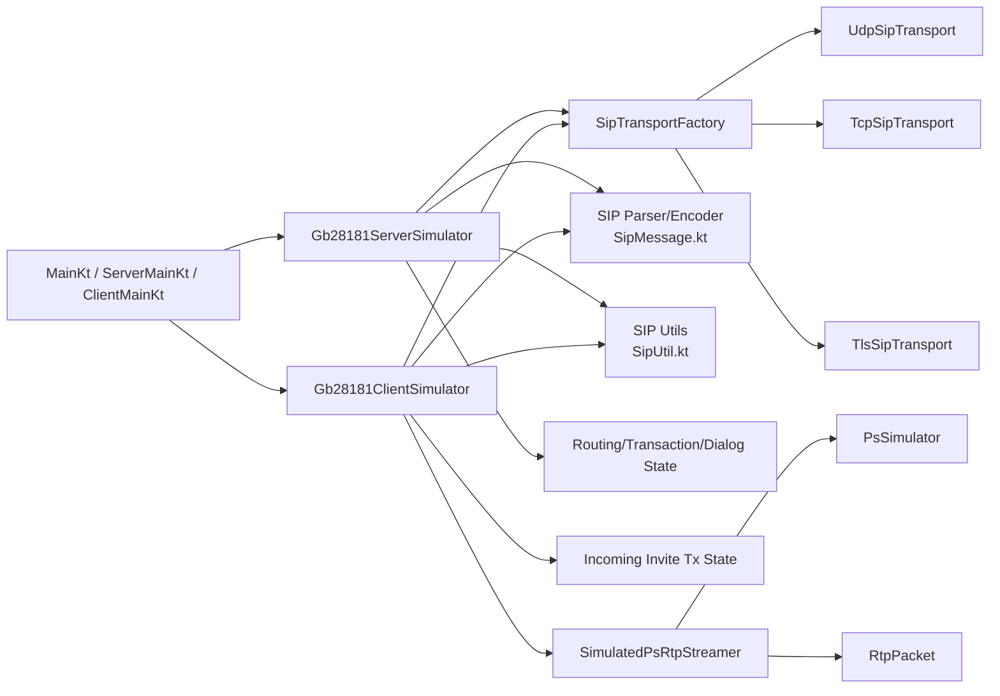
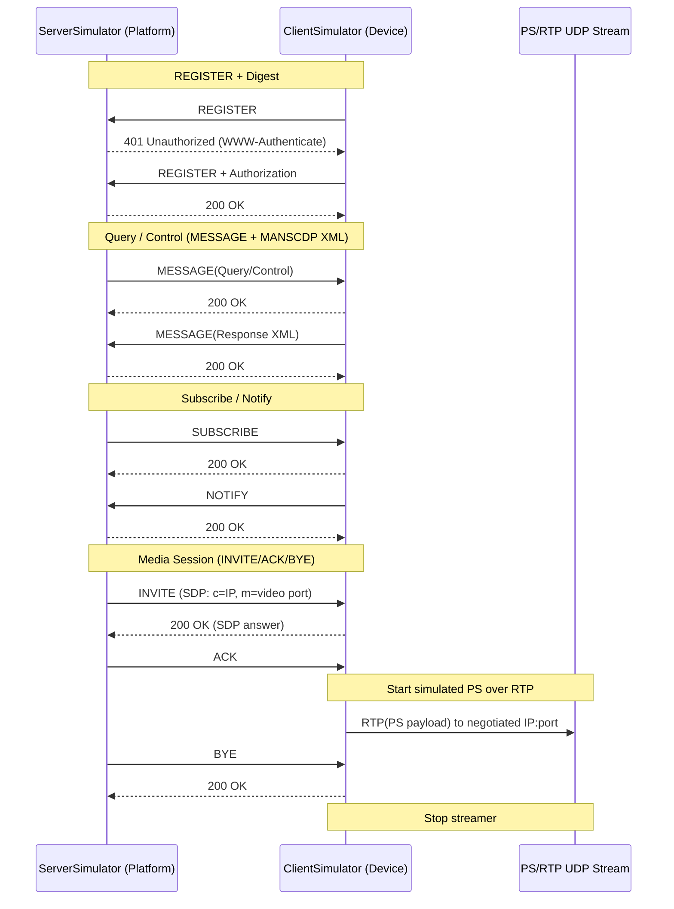
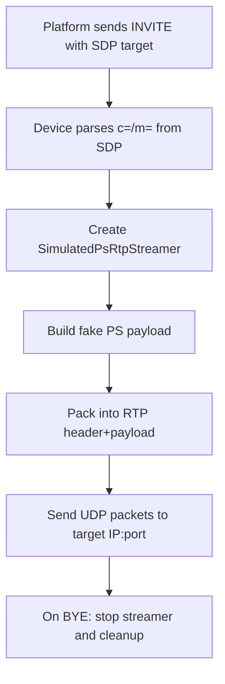

# GB28181 Simulator Architecture

This document describes the current simulator architecture for:

- SIP signaling
- PS over RTP simulated media
- server/client communication flow

## 0) GB28181 Architecture Summary (for design record)

### 0.1 Overall GB28181 Architecture

- Control plane: SIP signaling for registration, keepalive, query/control, subscribe/notify, and media session setup/teardown.
- Media plane: PS over RTP (simulated in this project) for media transport after SDP negotiation.
- Roles:
  - Platform side: `Gb28181ServerSimulator`
  - Device side: `Gb28181ClientSimulator`

### 0.2 SIP Architecture (Signaling)

- Registration/authentication:
  - `REGISTER -> 401 Digest challenge -> REGISTER(with auth) -> 200`
- Service signaling:
  - `MESSAGE` for MANSCDP query/control/response
  - `SUBSCRIBE/NOTIFY` for event subscription and event delivery
- Media session signaling:
  - `INVITE/200/ACK` for session establishment
  - `BYE/200` for session release
- Interop/robustness support:
  - UDP/TCP/TLS transports
  - Route/Record-Route handling (loose/strict routing)
  - CANCEL/481/487 handling
  - PRACK/100rel basic interop

### 0.3 PS Architecture (Media)

- Client parses media target from INVITE SDP (`c=` and `m=video`).
- Client creates `SimulatedPsRtpStreamer`.
- Streamer builds simulated PS payload and packs RTP packets.
- RTP packets are sent over UDP to negotiated IP/port.
- On `BYE`, streamer is stopped and session resources are cleaned up.

### 0.4 Client/Server Communication Pattern

- Server acts as platform, Client acts as device.
- Bi-directional SIP messages:
  - Client initiates REGISTER/keepalive.
  - Server initiates query/control/SUBSCRIBE/INVITE.
  - Client answers request and sends response/event notifications.
- Session binding:
  - SIP/SDP establishes media target.
  - PS/RTP flow follows negotiated endpoint until BYE.

## 1) Module Architecture

## 2) Signaling and Service Sequence

## 3) PS over RTP Simulated Media Path

## 4) Interactive Command Mapping

### Combined Console (`all` / `fault`)

- `status`: print server/client runtime summary
- `demo`: manually trigger demo flow
- `fault`: manually trigger negative fault flow
- `q-*`: query commands (`DeviceInfo`, `DeviceStatus`, `RecordInfo`, `Alarm`, config)
- `c-*`: control commands (PTZ, zoom, home position, reboot)
- `s-*`: subscription commands (`Alarm`, `MobilePosition`, `Catalog`)
- `i-*`: media signaling commands (`play`, `playback`, `download`, `talkback`)
- `bye`: teardown active dialog

### Server Console (`server`)

- same server-side command set as combined console
- useful for attaching a real/external GB device on SIP side

### Client Console (`client`)

- `status`
- `fault`
- used for device-side fault injection and status observation

## 5) Port Defaults

- server SIP: `5060`
- client SIP: `5061`
- media RTP ports: command-selectable (default examples `15060+`)

## 6) Test Procedure Appendix

### 6.1 End-to-End Manual Test (Interactive)

1. Start combined mode:
   - `./gradlew run --args="all 2022 udp hikvision"`
2. In console, confirm runtime state:
   - `status`
3. Registration/liveness:
   - wait for register logs, then `status`
4. Query/control path:
   - `q-info`
   - `q-status`
   - `c-ptz`
5. Subscription path:
   - `s-alarm 34020000001320000001 120`
6. Media signaling path:
   - `i-play 34020000001320000001 3402000000132000000101 16000`
7. Teardown:
   - `bye`

### 6.2 Packet Capture Validation (Wireshark)

- SIP signaling:
  - Filter: `udp.port==5060 || udp.port==5061` (or TCP/TLS equivalent)
  - Validate key sequences:
    - `REGISTER -> 401 -> REGISTER(auth) -> 200`
    - `INVITE -> 200 -> ACK`
    - `BYE -> 200`
- Media stream:
  - Filter: `udp.port==16000` (or selected RTP port)
  - Validate continuous UDP/RTP packets after INVITE success.
  - Validate stop after BYE.

### 6.3 Recommended Pass/Fail Checklist

- Registration success and steady keepalive.
- Query/control responses returned (`200` and XML response where expected).
- SUBSCRIBE/NOTIFY event flow visible.
- INVITE session established and RTP packets observed on target port.
- BYE terminates session and RTP packets stop.
- `status` output reflects expected session/subscription/stream counts.
